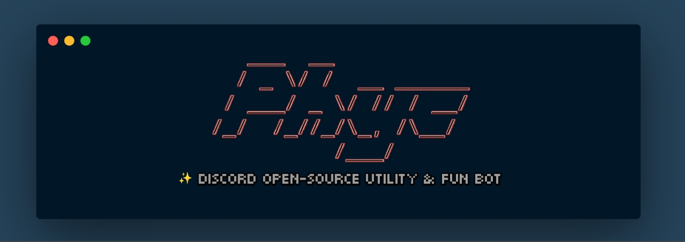

 
 ​
<h1 align=center><b>
 No longer maintained on GitHub
 <p></p>
 Development continued on <a href="https://gitlab.com/Tomkoid/Phyc">GitLab</a>
</b></h1>

<p align=center><b>Discord open-source JavaScript utility & fun bot</b></p>

---
​
---
- `1help` - Shows command list
---
**Moderation commands:**
- `1kick` - Kicks mentioned user
- `1ban` - Bans mentioned user
- `1clear` - Clears amount of messages given
- `1poll` - Creates poll with text given
---
**Fun commands:**
- `1meme` - Shows random meme
- `1stonks` - Creates image of your avatar with stonks meme
- `1gay` - Shows how many percent are you gay
- `1work` - Generates random stats of your work and income
- `1tpdne` - Generates image of person, that doesn't exist
- `1reverse` - Reverses given word
- `1ball` - Responds to given question
- `1owoify` - OwOifies given word
---
**MC commands:**
- `1mc <IP:PORT>` - Shows status of mc server
- `1mcpe <IP:PORT>` - Shows status of mcpe server
- `1mcserver` - Shows status of configured mc server
- `1mcpeserver` - Shows status of configured mcpe server
- `1mcserverset <IP:PORT>` - Configure mc server ip and port
- `1mcpeserverset <IP:PORT>` - Configure mcpe server ip and port
- `1mcserverrm` - Remove configured mc server
- `1mcserverrm` - Remove configured mcpe server
---
**Image commands:**
- `1cat` - Shows random cat image
- `1dog` - Shows random dog image
- `1goose` - Shows random goose image
- `1lizard` - Shows random lizard image
- `1animeavatar` - Shows random anime avatar
**AntiLink:**
- `1antilink on` - Enables AntiLink
- `1antilink off` - Disables AntiLink
---
**Accounts:**
- `1nordvpn` - Generates random NordVPN account
- `1nordvpnreport <Phyc Account ID>` - Reports given Phyc Account ID of NordVPN. Report **only** if account don't work or expired. 
---
**Invites:**
- `1botinvite` - Shows bot invite URL links (every one has different permissions)
- `1invite` - Generates unlimited invite link to server
---
**Other:**
- `1ping` - Shows bot's ping and API ping
---

​

***1. Clone this repository***
```
$ git clone https://github.com/TheDarknessToma/Phyc.git -b stable
```
***2. Get into Phyc directory***
```
$ cd Phyc/Phyc
```
***3. Install dependencies***
```
$ npm i discord.js nekos.life https
```
***3. Run Phyc***
```
$ node .
```
or
```
$ node index.js
```

***4. Set up permissions***
- These permissions you must allow on your discord server:
  - `SEND_MESSAGES`
  - `SEND_MESSAGES_IN_THREADS`
  - `MANAGE_MESSAGES`
  - `EMBED_LINKS`
  - `ATTACH_FILES`
  - `ADD_REACTIONS`
- You can check perms by 1perms command. It should return you `"No problem found".`
(if 1perms doesn't return you anything, then bot doesn't have permissions for sending messages)
---
**Original BOT:** Phyc#4288


​ 
